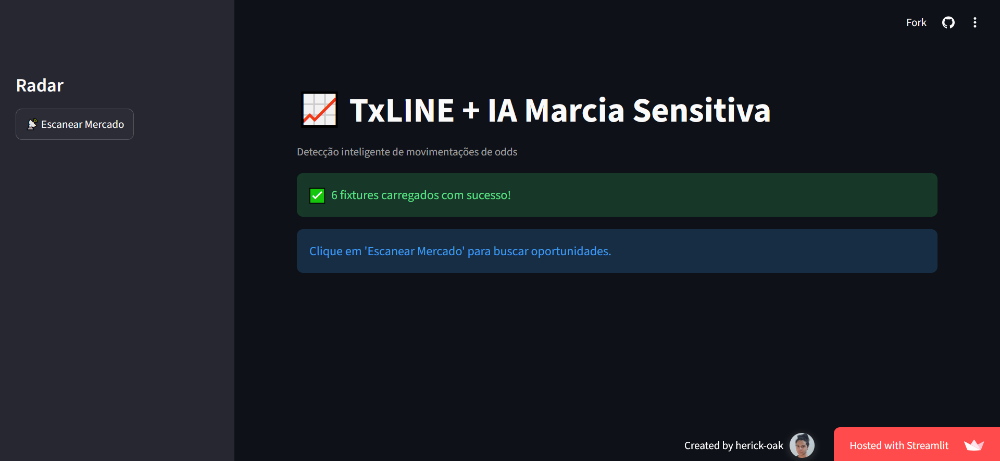
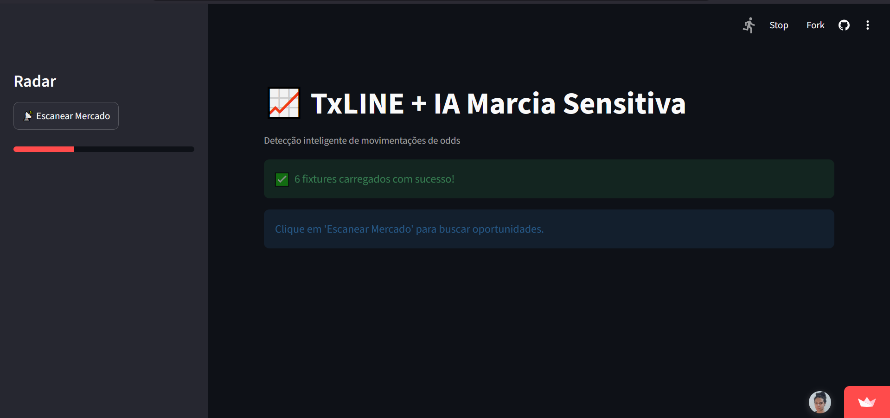
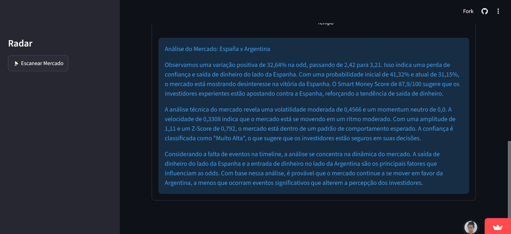

# 📸 Application Workflow

## 1️⃣ Home Screen

The application starts by loading the interface and retrieving the available football fixtures from the TxLINE API. From this screen, users can start a market scan with a single click.

  

---

## 2️⃣ Market Scanning

After clicking **"Scan Market"**, the application begins processing live fixtures and betting odds in real time. During this stage, market data is collected and analyzed to identify significant movements.

  

---

## 3️⃣ Opportunity Dashboard

Once the scan is completed, the dashboard displays the detected opportunities, including odds variation, volatility, momentum, confidence level, and the AI confidence score for each match.

  

---

## 4️⃣ AI-Powered Market Analysis

For each detected opportunity, the AI generates a contextual explanation by combining market movements, live match data, and statistical indicators. This analysis helps users better understand the current game scenario and possible market trends.

  

